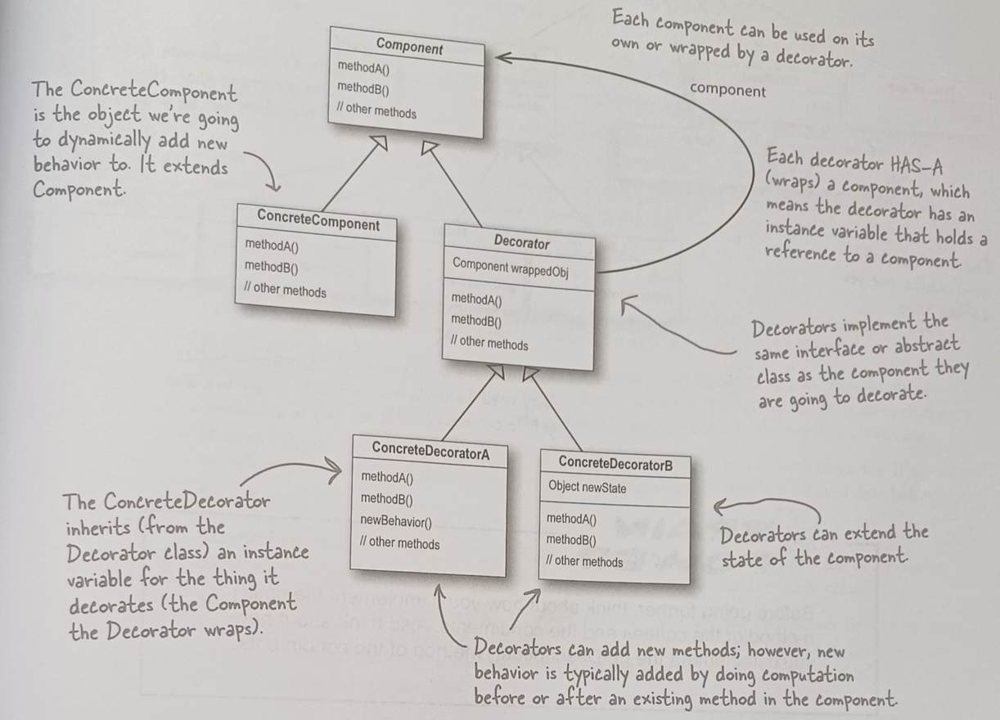
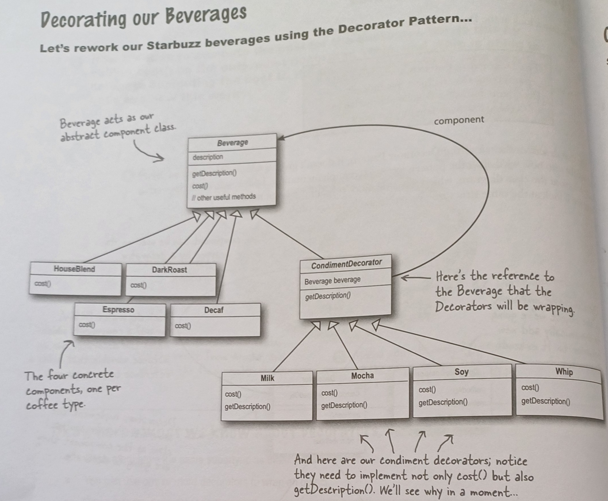
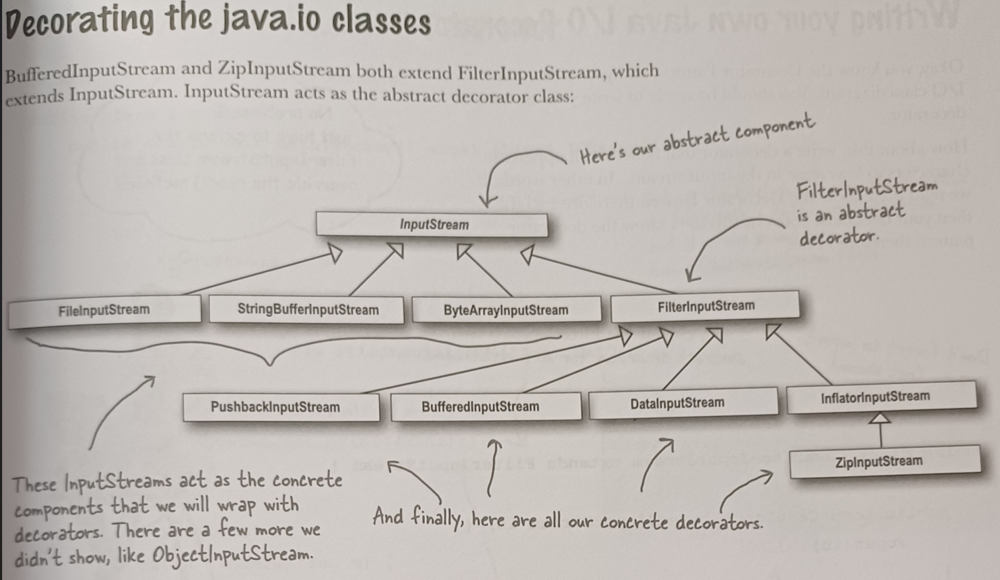

# Definition 

 **Decorator design pattern attaches additional responsibilities to an object dynamically.
 Decorator provides a flexible alternative to subclassing for extending functionality.**
 
# Class Diagram

# Example

# Realtime Example

