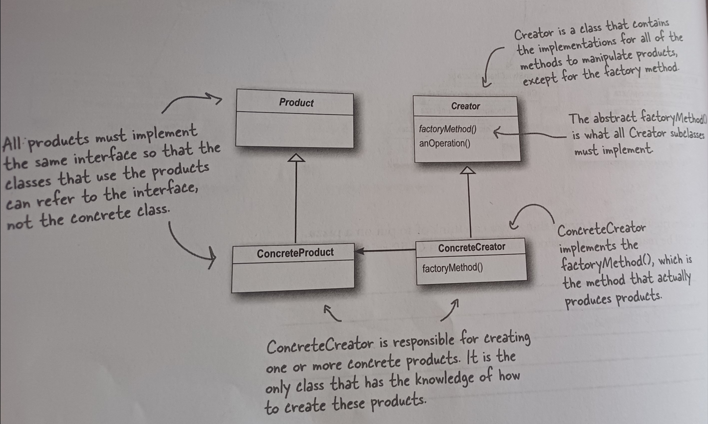
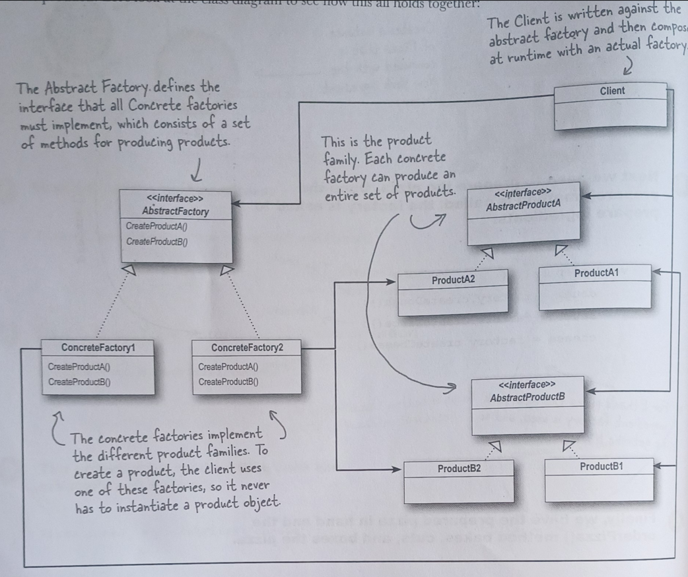

# Factory Method Definition

**Factory method defines interface for creating an object,
but lets subclass decide which class to instantiate.
Factory method lets a class defer instantiate to subclass**.

# Abstract Factory definition

T**he abstract factory pattern provides an interface 
for creating families of related or dependent objects without specifying their concrete class.**

