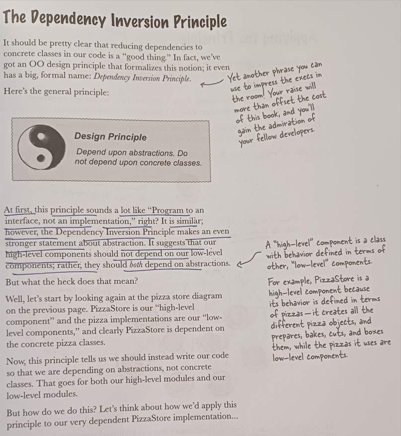
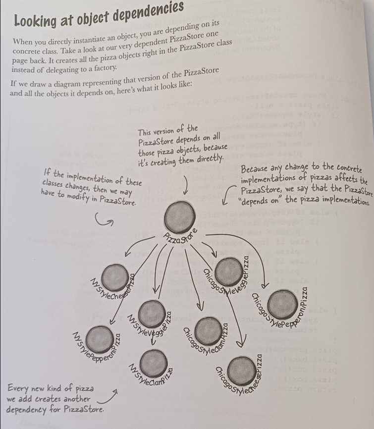
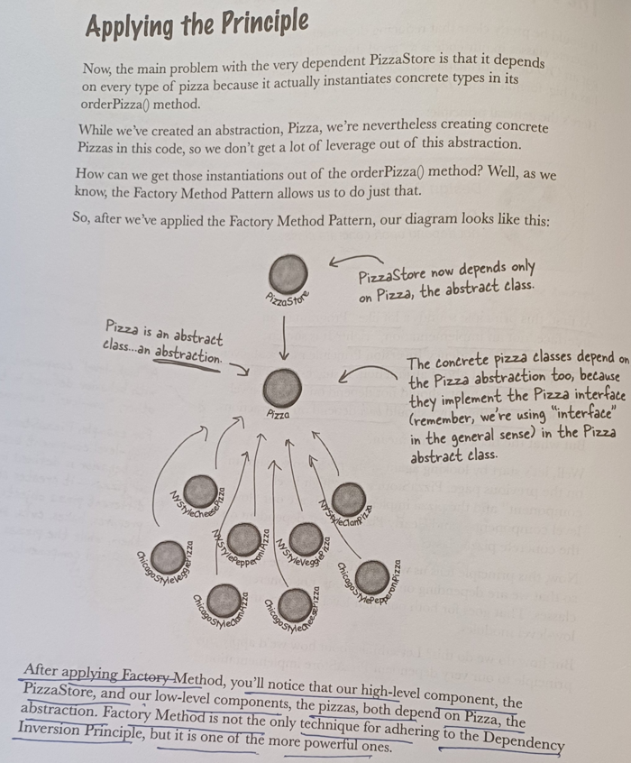
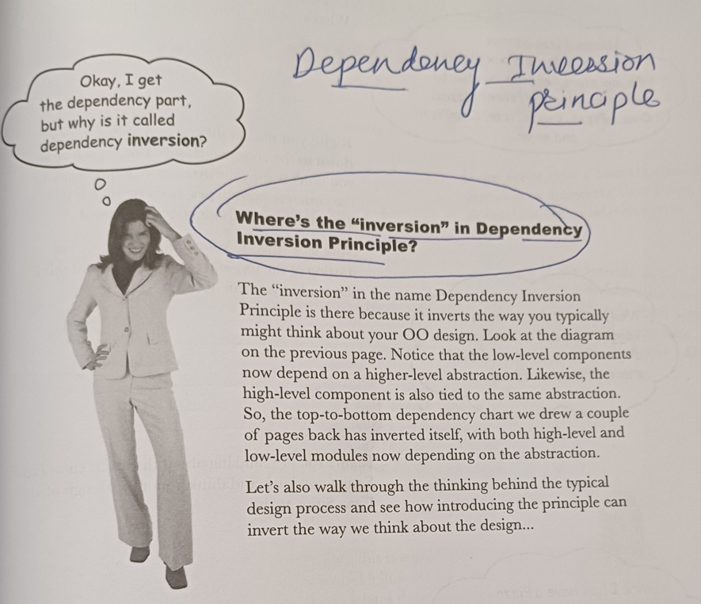
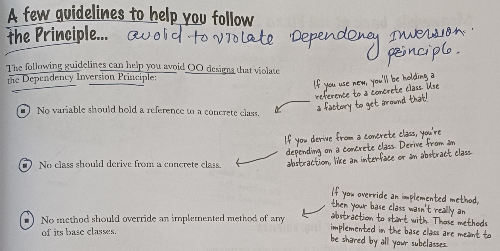

#  Dependency Inversion Principle

Depend upon abstractions. Do not depends upon concrete classes.

**It suggest that high-level components should not depends on low-level components.
rather both should depend on abstraction.**

 

